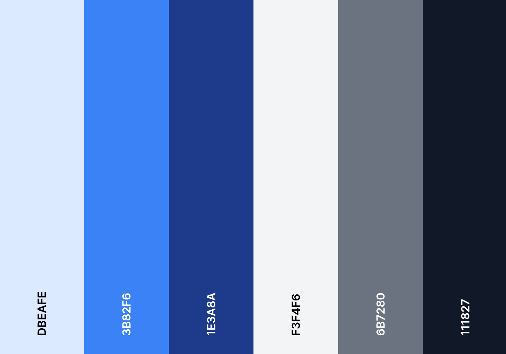

# Moments: Sharing Stories, Shaping Communities

A simple and user-friendly web application that allows users to engage in meaningful discussions, share captivating stories, and discover a world of diverse communities. 
With Moments, you can create an online space tailored to your interests and connect with like-minded individuals from around the globe.
<br />

<div style="display: flex; justify-content: start; align-items: center; column-gap: 20px">
    
    
    
    
    
    
    
</div>


Powered by [NextJS 13](https://nextjs.org/), [React 18](https://react.dev), [Typescript 5](https://www.typescriptlang.org), [Tailwind CSS 3](https://tailwindcss.com), [NextAuth 4](https://next-auth.js.org), [Prisma 4](https://www.prisma.io), [PlanetScale](https://planetscale.com)

### Exciting Features:

- **User Profiles**: Create a personalized username and update your profile picture to showcase your identity.
- **Privacy**: Maintain control over your personal information, as only your username and profile picture are visible to other users.
- **Communities**: Join existing communities or create your own to discuss specific topics and foster a sense of belonging among individuals with shared interests.
- **Community Posts**: Share your thoughts, stories, articles, and media with the community, encouraging diverse discussions and content sharing.
- **Comments and Replies**: Engage in conversations by commenting on posts and replying to other users' comments, promoting interactive and dynamic discussions.
- **Rich Text Editor**: Craft visually appealing and elegant posts with the help of the intuitive WYSIWYG editor powered by EditorJS and syntax highlighting with highlightJS.
- **Voting System**: Express your opinion by liking or disliking posts and comments, enabling users to collectively determine the popularity and relevance of content.
- **Search and Discover**: Effortlessly explore communities using a robust debounced search feature that swiftly provides relevant results.
- **NSFW Tags**: Mark communities and posts that may contain content not safe for work as NSFW, ensuring appropriate warnings and allowing users to make informed choices.
- **Blazing Fast**: Enjoy a lightning-fast browsing experience, ensuring quick load times and seamless navigation.


<hr />

## This section is for developers only

## Getting Started

First, run the development server:

```bash
npm run dev
# or
yarn dev
# or
pnpm dev
```

Open [http://localhost:3000](http://localhost:3000) with your browser to see the result.

This project uses [`next/font`](https://nextjs.org/docs/basic-features/font-optimization) to automatically optimize and 
load ***Inter***, a custom Google Font.


## Colour Palette


